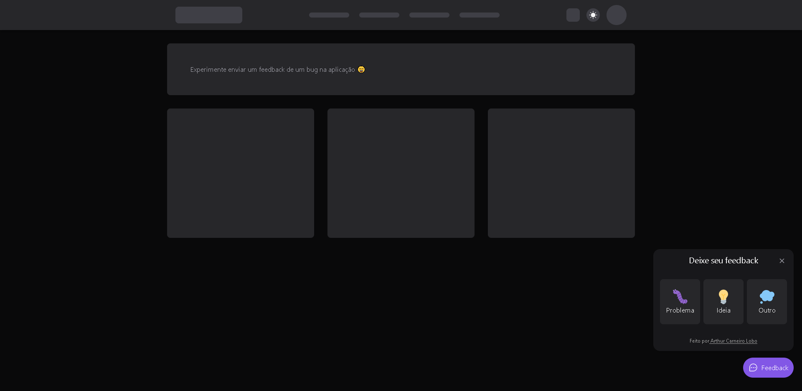

### Hi there! 👋

> A feedback widget for the user to share an idea, report issues or any other relevant information.
>
> The objective of this project was to improve my UX and UI skills and also the improvement of tools for frontend development such as React, Typescript, Tailwind, among others .
>
> The first version was developed in the [Rocketseat](https://www.rocketseat.com.br/) Next Level Week #8. After a year I decided to change some things in the project, putting into practice my experience acquired during that time.
>
> [Prototype in Figma](https://www.figma.com/file/ubcaCwqsQ2nfdseecGmr3b/Feedback-Widget-(Community)?type=design&node-id=100%3A2114&t=3NUTEwRa3e7zK44k-1)

## What is inside?

- [ReactJS](https://reactjs.org)
- [TypeScript](https://www.typescriptlang.org)
- [TailwindCSS](https://tailwindcss.com/)
- [Headless UI](https://headlessui.com/)
- [Phospor icons](https://phosphoricons.com/)
- [Axios](https://axios-http.com/ptbr/docs/intro)
- [html2canvas](https://html2canvas.hertzen.com/)
- [Eslint](https://eslint.org)
- [Prettier](https://prettier.io)
- [Vite](https://vitejs.dev/)

## Getting Started

### Install dependencies:

```bash
pnpm install
```

or

```bash
yarn
```

or

```bash
npm install
```

### Run development server

```bash
pnpm dev
```

or

```bash
yarn dev
```

or

```bash
npm run dev
```

Open [http://localhost:3000](http://localhost:3000) with your browser to see the result.

## Structure

```
└── src
    ├── assets
    ├── components
    ├── lib
```

| Folder         | Description                                          |
| ----------     | -------------------------------------------          |
| **assets**     | Images and static files for application              |
| **components** | Pages components                                     |
| **lib**        | Configuration of libraries used in the project       |

## Commands

- `dev`: run development server
- `build`: creates the production build version
- `lint`: runs the linter in all components and pages


## 📱 Mobile version

[Feedback Widget App](https://github.com/arthurlbo/feedback-widget-app)

<p align="center">Made with 🤍 by Arthur</p>
